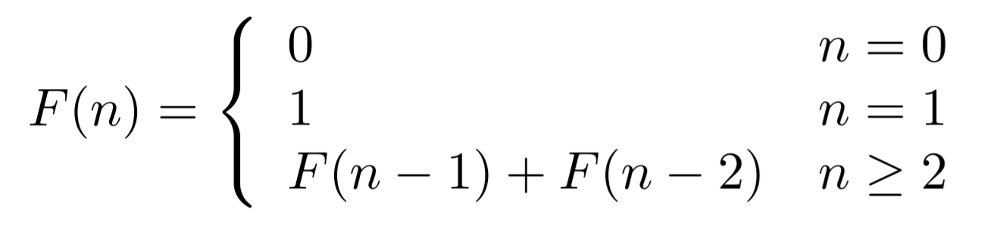
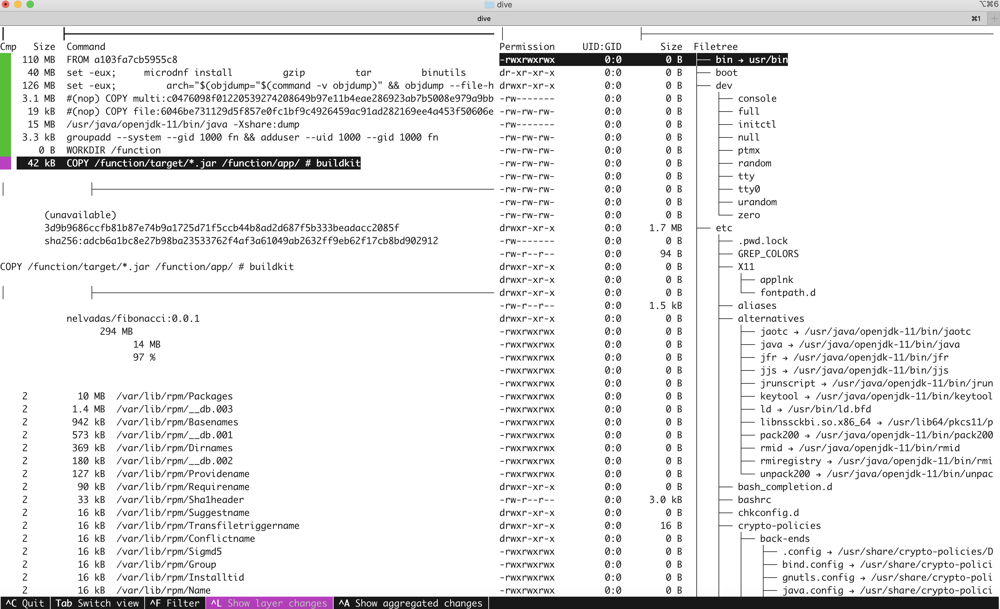

# Creating a simple Serverless Application  

<div class="inline-container">

<span> </span>
<span style="color:blue;font-weight:bold"></span>
<strong>
  Estimated time: 15 minutes
</strong>
</div>

<div class="inline-container">

<strong>References:</strong>
</div>

- [Building your Frist Function with Fn](https://github.com/fnproject/fn#your-first-function)
- [Fn Tutorials](https://fnproject.io/tutorials/)


In the following lab, we will create a simple [Fibonacci](https://en.wikipedia.org/wiki/Fibonacci_number) Serverless Function Using Java Streams and Fn SDK.

<a href="../1/">
    
</a>

A tiling with squares whose side lengths are successive Fibonacci numbers: 1, 1, 2, 3, 5, 8, 13 and 21.

<a href="../1/">
    
</a>


<div class="inline-container">

</div>

## Start Fn Server

From a terminal window Check the fn version 
```sh
$ fn version
Client version is latest version: 0.6.13
Server version:  0.3.749
```


First let's start the Fn local Server in DEBUG mode.
By default, the server starts on port `8080` 

```sh
$ fn start --log-level DEBUG
2022/02/14 22:22:15 ¡¡¡ 'fn start' should NOT be used for PRODUCTION !!! see https://github.com/fnproject/fn-helm/
time="2022-02-14T21:22:17Z" level=info msg="Setting log level to" fields.level=DEBUG
time="2022-02-14T21:22:17Z" level=info msg="Registering data store provider 'sql'"
time="2022-02-14T21:22:17Z" level=debug msg="creating new datastore" db=sqlite3
time="2022-02-14T21:22:17Z" level=debug msg="mysql does not support sqlite3"
time="2022-02-14T21:22:17Z" level=debug msg="postgres does not support sqlite3"
time="2022-02-14T21:22:17Z" level=debug msg="mysql does not support sqlite3"
time="2022-02-14T21:22:17Z" level=debug msg="postgres does not support sqlite3"
time="2022-02-14T21:22:17Z" level=info msg="Connecting to DB" url="sqlite3:///app/data/fn.db"
time="2022-02-14T21:22:17Z" level=info msg="datastore dialed" datastore=sqlite3 max_idle_connections=256 url="sqlite3:///app/data/fn.db"
time="2022-02-14T21:22:17Z" level=debug msg="mysql does not support sqlite3"
time="2022-02-14T21:22:17Z" level=debug msg="postgres does not support sqlite3"
time="2022-02-14T21:22:17Z" level=info msg="agent starting cfg={MinDockerVersion:17.10.0-ce ContainerLabelTag: DockerNetworks: DockerLoadFile: DisableUnprivilegedContainers:false FreezeIdle:50ms HotPoll:200ms HotLauncherTimeout:1h0m0s HotPullTimeout:10m0s HotStartTimeout:5s DetachedHeadRoom:6m0s MaxResponseSize:0 MaxHdrResponseSize:0 MaxLogSize:1048576 MaxTotalCPU:0 MaxTotalMemory:0 MaxFsSize:0 MaxPIDs:50 MaxOpenFiles:0xc4201cbd18 MaxLockedMemory:0xc4201cbd30 MaxPendingSignals:0xc4201cbd38 MaxMessageQueue:0xc4201cbd40 PreForkPoolSize:0 PreForkImage:busybox PreForkCmd:tail -f /dev/null PreForkUseOnce:0 PreForkNetworks: EnableNBResourceTracker:false MaxTmpFsInodes:0 DisableReadOnlyRootFs:false DisableDebugUserLogs:false IOFSEnableTmpfs:false EnableFDKDebugInfo:false IOFSAgentPath:/iofs IOFSMountRoot:/Users/nono/.fn/iofs IOFSOpts: ImageCleanMaxSize:0 ImageCleanExemptTags: ImageEnableVolume:false}"
time="2022-02-14T21:22:17Z" level=info msg="no docker auths from config files found (this is fine)" error="open /root/.dockercfg: no such file or directory"
time="2022-02-14T21:22:17Z" level=info msg="available memory" cgroup_limit=9223372036854771712 head_room=673241497 total_memory=6732414976
time="2022-02-14T21:22:17Z" level=info msg="ram reservations" avail_memory=6059173479
time="2022-02-14T21:22:17Z" level=info msg="available cpu" avail_cpu=6000 total_cpu=6000
time="2022-02-14T21:22:17Z" level=info msg="cpu reservations" cpu=6000
time="2022-02-14T21:22:17Z" level=info msg="\n        ______\n       / ____/___\n      / /_  / __ \\\n     / __/ / / / /\n    /_/   /_/ /_/\n"
time="2022-02-14T21:22:17Z" level=info msg="Fn serving on `:8080`" type=full version=0.3.749

```

## Create Fn Application

In another terminal window, Create your first fn Application 

```sh 
$  mkdir graal-fn-demo
$ cd graal-fn-demo/
```
Now initialize your first Fn application 

```sh
$ $ fn create app graal-fn-demo
Successfully created app:  graal-fn-demo
```

Check the created application 

```sh
$ fn list app
NAME  ID
graal-fn-demo 01FVX21T29NG8G00GZJ0000002
```
applications act as a container for Fn functions, In the `graal-fn-demo` app, let's create the Fibonacci Function 

Create a subdirectory `graal-fn-demo/fibonacci` to encapsulate the function objects. 


```sh
$ mkdir fibonacci
$ cd fibonacci 
```
Now, Initialize the fibonaci java function with version 1.0.0

```sh 
$ fn init --runtime java11 --trigger http --name fibonacci
Function boilerplate generated.
func.yaml created.
```
The function is created with a couple of files and directories 

```sh 
nono-mac:fibonacci nono$ tree
.
├── func.yaml
├── pom.xml
└── src
    ├── main
    │   └── java
    │       └── com
    │           └── example
    │               └── fn
    │                   └── HelloFunction.java
    └── test
        └── java
            └── com
                └── example
                    └── fn
                        └── HelloFunctionTest.java

11 directories, 4 files
```
Edit the yaml file to match the following constraints

:one: Rename package from com.example.fn to `com.oracle.graalvm.fn` <br>
:two: Rename the HelloFunction Class to `FibonacciFunction` <br>
:three:  In the pom.xml file change the application groupId to `<groupId>com.oracle.graalvm.fn</groupId>` <br>
:four: In the pom.xml file rename the artifactId to `<artifactId>fibonacci</artifactId>` <br>
:five: Edit the `cmd` starting command in the `func.yaml` file accordingly `cmd: com.oracle.graalvm.fn.FibonacciFunction::handleRequest` <br>
:six: Update the `com.oracle.graalvm.fn.FibonacciFunction::handleRequest`<br> with the following code snipet
```java
package com.oracle.graalvm.fn;
import java.util.Comparator;
import java.util.stream.Stream;

    public Long handleRequest(String input) {
        try {
            // Convert the received string input to Integer Type
            Integer inputInt = Integer.valueOf(input);
            long result = 0;
            //Compute the associated Fibonacci Number
            result = Stream.iterate( new int[]{0,1}, fib-> new int[]{fib[1], fib[0]+fib[1]} )
                    .limit(inputInt)
                    .map(x->x[1])
                    .max(Comparator.naturalOrder())
                    .get()
                    .longValue();
            return result;
        }catch ( NumberFormatException nfe ){
            System.out.println("Invalid parameter received " + input);
            nfe.printStackTrace();
        }
        // In case of error return -1l
        return -1l;
    }
}
```

:seven: Update the test class `com.oracle.graalvm.fn.FibonacciFunctionTest`with 

```java 
package com.oracle.graalvm.fn;
import com.fnproject.fn.testing.*;
import org.junit.*;

import static org.junit.Assert.*;

public class FibonacciFunctionTest {
    @Rule
    public final FnTestingRule testing = FnTestingRule.createDefault();
    @Test
    public void shouldReturnFibonaciNumber() {
        testing.givenEvent()
        //Compute Fib(8) - The most important portion of the yello square
                .withBody("8")
                .enqueue();
        testing.thenRun(FibonacciFunction.class, "handleRequest");
        FnResult result = testing.getOnlyResult();
        // should be 21
        assertEquals("21", result.getBodyAsString());
    }
}
```


:eigth: Use GraalVM SDK as your IDE Java and Test your function using Maven 

```shell 
$ sdk use java 22.0.0-ee11
Using java version 22.0.0-ee11 in this shell.

$ java -version
java version "11.0.14" 2022-01-18 LTS
Java(TM) SE Runtime Environment GraalVM EE 22.0.0 (build 11.0.14+8-LTS-jvmci-22.0-b03)
Java HotSpot(TM) 64-Bit Server VM GraalVM EE 22.0.0 (build 11.0.14+8-LTS-jvmci-22.0-b03, mixed mode, sharing)
```

Run the unit test with Maven 
```sh 
$ mvn test
[INFO] Scanning for projects...
[INFO] 
[INFO] ------------------< com.oracle.graalvm.fn:fibonacci >-------------------
[INFO] Building fibonacci 1.0.0
[INFO] --------------------------------[ jar ]---------------------------------
[INFO] 
[INFO] --- maven-resources-plugin:2.6:resources (default-resources) @ fibonacci ---
[INFO] Using 'UTF-8' encoding to copy filtered resources.
[INFO] skip non existing resourceDirectory /Users/nono/Projects/Workshops/EMEA-HOL-GraalVMServerless/graalvm-serverless/1/graal-fn-demo/fibonacci/src/main/resources
[INFO] 
[INFO] --- maven-compiler-plugin:3.3:compile (default-compile) @ fibonacci ---
[INFO] Nothing to compile - all classes are up to date
[INFO] 
[INFO] --- maven-resources-plugin:2.6:testResources (default-testResources) @ fibonacci ---
[INFO] Using 'UTF-8' encoding to copy filtered resources.
[INFO] skip non existing resourceDirectory /Users/nono/Projects/Workshops/EMEA-HOL-GraalVMServerless/graalvm-serverless/1/graal-fn-demo/fibonacci/src/test/resources
[INFO] 
[INFO] --- maven-compiler-plugin:3.3:testCompile (default-testCompile) @ fibonacci ---
[INFO] Changes detected - recompiling the module!
[INFO] Compiling 1 source file to /Users/nono/Projects/Workshops/EMEA-HOL-GraalVMServerless/graalvm-serverless/1/graal-fn-demo/fibonacci/target/test-classes
[INFO] 
[INFO] --- maven-surefire-plugin:2.22.1:test (default-test) @ fibonacci ---
[INFO] 
[INFO] -------------------------------------------------------
[INFO]  T E S T S
[INFO] -------------------------------------------------------
[INFO] Running com.oracle.graalvm.fn.FibonacciFunctionTest
[INFO] Tests run: 1, Failures: 0, Errors: 0, Skipped: 0, Time elapsed: 0.46 s - in com.oracle.graalvm.fn.FibonacciFunctionTest
[INFO] 
[INFO] Results:
[INFO] 
[INFO] Tests run: 1, Failures: 0, Errors: 0, Skipped: 0
[INFO] 
[INFO] ------------------------------------------------------------------------
[INFO] BUILD SUCCESS
[INFO] ------------------------------------------------------------------------
[INFO] Total time:  2.504 s
[INFO] Finished at: 2022-02-14T23:31:05+01:00
[INFO] ------------------------------------------------------------------------
```

## Build and deploy the Serverless Application Locaaly 

Before building our function, let us explore and customize the local context

### Contexts Management


```sh 
$ fn list contexts
CURRENT NAME        PROVIDER API URL       REGISTRY
default default  http://localhost:8080     
```

Add your docker-id as registry in the default context 


```sh 
fn update context registry <your-docker-id>
```

For me 

```
fn update context registry nelvadas
```

The context is updated accordingly 
```sh
$ fn list contexts
CURRENT NAME        PROVIDER API URL       REGISTRY
default default  http://localhost:8080     nelvadas
```


### Build 


Now let's package the fibonacci function

```sh 
$$ fn build -v
Using Container engine docker
Building image nelvadas/fibonacci:0.0.1
FN_REGISTRY:  nelvadas
Current Context:  default
[+] Building 1.3s (15/15) FINISHED
 => [internal] load build definition from Dockerfile214563689                                                                                                                  0.0s
 => => transferring dockerfile: 729B                                                                                                                                           0.0s
 => [internal] load .dockerignore                                                                                                                                              0.0s
 => => transferring context: 2B                                                                                                                                                0.0s
 => [internal] load metadata for docker.io/fnproject/fn-java-fdk:jre11-1.0.145                                                                                                 1.2s
 => [internal] load metadata for docker.io/fnproject/fn-java-fdk-build:jdk11-1.0.145                                                                                           1.2s
 => [build-stage 1/6] FROM docker.io/fnproject/fn-java-fdk-build:jdk11-1.0.145@sha256:d1a3e06e1f3fb4c3aa4bbe776b90cb074f9e605eedac9ff1db70060873025165                         0.0s
 => [stage-1 1/3] FROM docker.io/fnproject/fn-java-fdk:jre11-1.0.145@sha256:44e31570ba93566ed6862b6ebb036c9d622af68a5d7c9da238bb9e2f4bcc0fde                                   0.0s
 => [internal] load build context                                                                                                                                              0.0s
 => => transferring context: 710B                                                                                                                                              0.0s
 => CACHED [stage-1 2/3] WORKDIR /function                                                                                                                                     0.0s
 => CACHED [build-stage 2/6] WORKDIR /function                                                                                                                                 0.0s
 => CACHED [build-stage 3/6] ADD pom.xml /function/pom.xml                                                                                                                     0.0s
 => CACHED [build-stage 4/6] RUN ["mvn", "package", "dependency:copy-dependencies", "-DincludeScope=runtime", "-DskipTests=true", "-Dmdep.prependGroupId=true", "-DoutputDire  0.0s
 => CACHED [build-stage 5/6] ADD src /function/src                                                                                                                             0.0s
 => CACHED [build-stage 6/6] RUN ["mvn", "package"]                                                                                                                            0.0s
 => CACHED [stage-1 3/3] COPY --from=build-stage /function/target/*.jar /function/app/                                                                                         0.0s
 => exporting to image                                                                                                                                                         0.0s
 => => exporting layers                                                                                                                                                        0.0s
 => => writing image sha256:183aaaefb8229f64c8c56862beb33b693bf35306852b481a4583e18c87222211                                                                                   0.0s
 => => naming to docker.io/nelvadas/fibonacci:0.0.1                                                                                                                            0.0s

Use 'docker scan' to run Snyk tests against images to find vulnerabilities and learn how to fix them

Function nelvadas/fibonacci:0.0.1 built successfully
```

The function is build and a new docker image is produced.
In this Docker image, the application Jar file  is packaged as an additonnal layer of an image containing a Java Runtime Environment  `fnproject/fn-java-fdk:jre11-1.0.145`

Navigate through the generated image using the `dive`tool 

```sh
dive nelvadas/fibonacci:0.0.1
```



### Local Deployment 

Deploy the function on the local running server using fn deploy 

```sh 
$ fn deploy --app graal-fn-demo --local --no-bump
Using Container engine docker
Building image nelvadas/fibonacci:0.0.1 ..
Updating function fibonacci using image nelvadas/fibonacci:0.0.1...
Successfully created function: fibonacci with nelvadas/fibonacci:0.0.1
Successfully created trigger: fibonacci
Trigger Endpoint: http://localhost:8080/t/graal-fn-demo/fibonacci
```
The no-bump argument assumes external version management .

The functions list of the graal-fn-demo applications is updated with the new function 
```sh
$ fn list functions graal-fn-demo
NAME  IMAGE    ID
fibonacci nelvadas/fibonacci:0.0.1 01FVX74J8XNG8G00GZJ0000003
```


### Invoke the function 

- Inspect 
```sh 
$ fn inspect function graal-fn-demo fibonacci
{
 "annotations": {
  "fnproject.io/fn/invokeEndpoint": "http://localhost:8080/invoke/01FVX74J8XNG8G00GZJ0000003"
 },
 "app_id": "01FVX21T29NG8G00GZJ0000002",
 "created_at": "2022-02-14T22:55:00.893Z",
 "id": "01FVX74J8XNG8G00GZJ0000003",
 "idle_timeout": 30,
 "image": "nelvadas/fibonacci:0.0.1",
 "memory": 128,
 "name": "fibonacci",
 "timeout": 30,
 "updated_at": "2022-02-14T22:55:00.893Z"
}
```


```sh
$ curl  -X POST --data 8  http://localhost:8080/t/graal-fn-demo/fibonacci
21
```


##
Next, we'll try to create a Optimize the function with GraalVM Enterprise .

---
<a href="../1/">
    
</a>


# References 
<https://docs.oracle.com/en-us/iaas/Content/Functions/Tasks/functionsusingwithfncli.htm>

