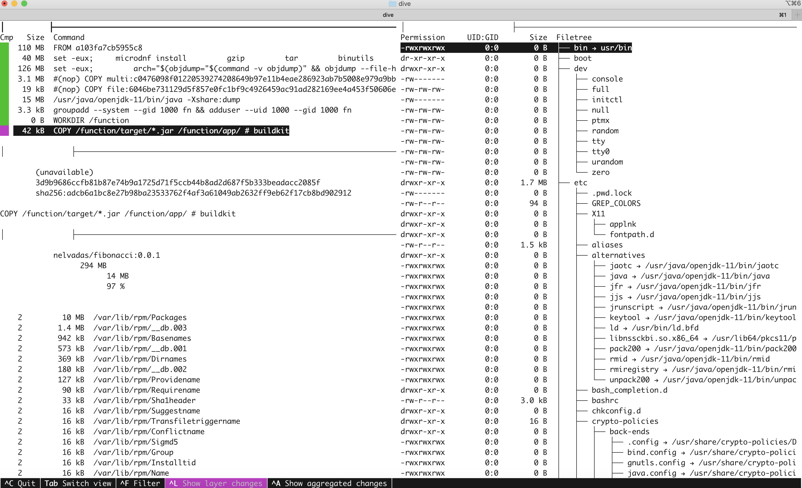

# Fibonacci Go  

<div class="inline-container">

<span> </span>
<span style="color:blue;font-weight:bold"></span>
<strong>
  Estimated time: 15 minutes
</strong>
</div>

<div class="inline-container">

<strong>References:</strong>
</div>

- [Building your Frist Function with Fn](https://github.com/fnproject/fn#your-first-function)
- [Fn Tutorials](https://fnproject.io/tutorials/)


In the following lab, we will create the same  [Fibonacci](https://en.wikipedia.org/wiki/Fibonacci_number) Serverless Function Using  Go Lang  Fn SDK.

<a href="../1/">
    
</a>

A tiling with squares whose side lengths are successive Fibonacci numbers: 1, 1, 2, 3, 5, 8, 13 and 21.

<a href="../1/">
    
</a>


<div class="inline-container">

</div>

## Start Fn Server

From a terminal window Check the fn version 
```sh
$ fn version
Client version is latest version: 0.6.13
Server version:  0.3.749
```


First let's start the Fn local Server in DEBUG mode.
By default, the server starts on port `8080` 

```sh
$ fn start --log-level DEBUG
2022/02/14 22:22:15 ¡¡¡ 'fn start' should NOT be used for PRODUCTION !!! see https://github.com/fnproject/fn-helm/
time="2022-02-14T21:22:17Z" level=info msg="Setting log level to" fields.level=DEBUG
time="2022-02-14T21:22:17Z" level=info msg="Registering data store provider 'sql'"
time="2022-02-14T21:22:17Z" level=debug msg="creating new datastore" db=sqlite3
time="2022-02-14T21:22:17Z" level=debug msg="mysql does not support sqlite3"
time="2022-02-14T21:22:17Z" level=debug msg="postgres does not support sqlite3"
time="2022-02-14T21:22:17Z" level=debug msg="mysql does not support sqlite3"
time="2022-02-14T21:22:17Z" level=debug msg="postgres does not support sqlite3"
time="2022-02-14T21:22:17Z" level=info msg="Connecting to DB" url="sqlite3:///app/data/fn.db"
time="2022-02-14T21:22:17Z" level=info msg="datastore dialed" datastore=sqlite3 max_idle_connections=256 url="sqlite3:///app/data/fn.db"
time="2022-02-14T21:22:17Z" level=debug msg="mysql does not support sqlite3"
time="2022-02-14T21:22:17Z" level=debug msg="postgres does not support sqlite3"
time="2022-02-14T21:22:17Z" level=info msg="agent starting cfg={MinDockerVersion:17.10.0-ce ContainerLabelTag: DockerNetworks: DockerLoadFile: DisableUnprivilegedContainers:false FreezeIdle:50ms HotPoll:200ms HotLauncherTimeout:1h0m0s HotPullTimeout:10m0s HotStartTimeout:5s DetachedHeadRoom:6m0s MaxResponseSize:0 MaxHdrResponseSize:0 MaxLogSize:1048576 MaxTotalCPU:0 MaxTotalMemory:0 MaxFsSize:0 MaxPIDs:50 MaxOpenFiles:0xc4201cbd18 MaxLockedMemory:0xc4201cbd30 MaxPendingSignals:0xc4201cbd38 MaxMessageQueue:0xc4201cbd40 PreForkPoolSize:0 PreForkImage:busybox PreForkCmd:tail -f /dev/null PreForkUseOnce:0 PreForkNetworks: EnableNBResourceTracker:false MaxTmpFsInodes:0 DisableReadOnlyRootFs:false DisableDebugUserLogs:false IOFSEnableTmpfs:false EnableFDKDebugInfo:false IOFSAgentPath:/iofs IOFSMountRoot:/Users/nono/.fn/iofs IOFSOpts: ImageCleanMaxSize:0 ImageCleanExemptTags: ImageEnableVolume:false}"
time="2022-02-14T21:22:17Z" level=info msg="no docker auths from config files found (this is fine)" error="open /root/.dockercfg: no such file or directory"
time="2022-02-14T21:22:17Z" level=info msg="available memory" cgroup_limit=9223372036854771712 head_room=673241497 total_memory=6732414976
time="2022-02-14T21:22:17Z" level=info msg="ram reservations" avail_memory=6059173479
time="2022-02-14T21:22:17Z" level=info msg="available cpu" avail_cpu=6000 total_cpu=6000
time="2022-02-14T21:22:17Z" level=info msg="cpu reservations" cpu=6000
time="2022-02-14T21:22:17Z" level=info msg="\n        ______\n       / ____/___\n      / /_  / __ \\\n     / __/ / / / /\n    /_/   /_/ /_/\n"
time="2022-02-14T21:22:17Z" level=info msg="Fn serving on `:8080`" type=full version=0.3.749

```

## Create Fn Application

In another terminal window, Create your first fn Application 

```sh 
$  mkdir graal-fn-demo
$ cd graal-fn-demo/
```
Now initialize your first Fn application 

```sh
$ $ fn create app goapp
```

 


```sh 
$ fn init --runtime go --trigger http --name fibonaccigo

```
The function is created with a couple of files and directories 

Edit the func.go
```go
package main

import (
 "context"
 "encoding/json"
 "io"
 "log"

 fdk "github.com/fnproject/fdk-go"
)

func main() {
 fdk.Handle(fdk.HandlerFunc(myHandler))
}

type Fib struct {
 Input int `json:"input"`;
 Output int `json:"output"`
}


func fibonacci(n int) int {
 first, second := 0, 1
 for i:=0;i<n;i++{
  first, second = second, first+second
         }
 return first
}

func myHandler(ctx context.Context, in io.Reader, out io.Writer) {
 f := &Fib{Input: 10}
 json.NewDecoder(in).Decode(f)
 f.Output  = fibonacci(f.Input)
        log.Print("Inside Go Fibonacci function")
 json.NewEncoder(out).Encode(&f)
}
```


### Build 


Now let's package the fibonacci function

```sh 
$fn --verbose deploy --app goapp --local
Deploying fibonaccigo to app: goapp
Bumped to version 0.0.14
Using Container engine docker
Building image nelvadas/fibonaccigo:0.0.14
FN_REGISTRY:  nelvadas
Current Context:  default
[+] Building 5.2s (15/15) FINISHED
 => [internal] load build definition from Dockerfile333135114                                                                                                                             0.0s
 => => transferring dockerfile: 320B                                                                                                                                                      0.0s
 => [internal] load .dockerignore                                                                                                                                                         0.0s
 => => transferring context: 2B                                                                                                                                                           0.0s
 => [internal] load metadata for docker.io/fnproject/go:1.15                                                                                                                              1.2s
 => [internal] load metadata for docker.io/fnproject/go:1.15-dev                                                                                                                          1.2s
 => [auth] fnproject/go:pull token for registry-1.docker.io                                                                                                                               0.0s
 => [stage-1 1/3] FROM docker.io/fnproject/go:1.15@sha256:26a4fc320eb78f6dc0bd7b07921892ae1d63ca22baf0287f3fa6b7e92eeba43f                                                                0.0s
 => [internal] load build context                                                                                                                                                         0.0s
 => => transferring context: 627B                                                                                                                                                         0.0s
 => [build-stage 1/5] FROM docker.io/fnproject/go:1.15-dev@sha256:3f0cc5b217be4af2a6b845d1b5a1a72f686f7a8a2017cc4d4134b85e3f17ab5a                                                        0.0s
 => CACHED [build-stage 2/5] WORKDIR /function                                                                                                                                            0.0s
 => CACHED [build-stage 3/5] WORKDIR /go/src/func/                                                                                                                                        0.0s
 => [build-stage 4/5] COPY . .                                                                                                                                                            0.0s
 => [build-stage 5/5] RUN cd /go/src/func/ && go build -o func                                                                                                                            3.9s
 => CACHED [stage-1 2/3] WORKDIR /function                                                                                                                                                0.0s
 => CACHED [stage-1 3/3] COPY --from=build-stage /go/src/func/func /function/                                                                                                             0.0s
 => exporting to image                                                                                                                                                                    0.0s
 => => exporting layers                                                                                                                                                                   0.0s
 => => writing image sha256:8e578036a446106d23e5872ee1b5d9778b4cec5710095bad14f5c53b184b6a6e                                                                                              0.0s
 => => naming to docker.io/nelvadas/fibonaccigo:0.0.14
```

The function is build and a new docker image is produced.
In this Docker image, the application Jar file  is packaged as an additonnal layer of an image containing a Java Runtime Environment  `fnproject/fn-java-fdk:jre11-1.0.145`

Navigate through the generated image using the `dive`tool 

```sh
dive nelvadas/fibonacci:0.0.1
```



### Local Deployment 

Deploy the function on the local running server using fn deploy 

```sh 
$ fn deploy --app graal-fn-demo --local --no-bump
Using Container engine docker
Building image nelvadas/fibonacci:0.0.1 ..
Updating function fibonacci using image nelvadas/fibonacci:0.0.1...
Successfully created function: fibonacci with nelvadas/fibonacci:0.0.1
Successfully created trigger: fibonacci
Trigger Endpoint: http://localhost:8080/t/graal-fn-demo/fibonacci
```
The no-bump argument assumes external version management .

The functions list of the graal-fn-demo applications is updated with the new function 
```sh
$ fn list functions graal-fn-demo
NAME  IMAGE    ID
fibonacci nelvadas/fibonacci:0.0.1 01FVX74J8XNG8G00GZJ0000003
```


### Invoke the function 

- Inspect 
```sh 
$ fn inspect function graal-fn-demo fibonacci
{
 "annotations": {
  "fnproject.io/fn/invokeEndpoint": "http://localhost:8080/invoke/01FVX74J8XNG8G00GZJ0000003"
 },
 "app_id": "01FVX21T29NG8G00GZJ0000002",
 "created_at": "2022-02-14T22:55:00.893Z",
 "id": "01FVX74J8XNG8G00GZJ0000003",
 "idle_timeout": 30,
 "image": "nelvadas/fibonacci:0.0.1",
 "memory": 128,
 "name": "fibonacci",
 "timeout": 30,
 "updated_at": "2022-02-14T22:55:00.893Z"
}
```

### Invoke the function 
- with `fn invoke`

```sh
$ echo -n '10' | fn invoke graal-fn-demo  fibonacci
55
```

- With curl: Hit the function's http trigger 

```cmd
$ curl  -X POST --data 8  http://localhost:8080/t/graal-fn-demo/fibonacci
21
```

## Fn Performance

Let's run a benchmark on the existing serverless function with `hey`()
For each function invocation, a docker container is created to serve the request.

Create an Body file for the benchmark; for this we want to get Fibonaci(100)

```sh
$ echo 100 > data.txt
$ cat data.txt
100
```

Now run 1000 requests with 100 cucurrent calls.

```sh
$ $ hey -n 1000 -c 100  -m POST -D data.json  http://localhost:8080/t/goapp/fibonaccigo

Summary:
  Total: 8.1749 secs
  Slowest: 7.2793 secs
  Fastest: 0.0049 secs
  Average: 0.7283 secs
  Requests/sec: 122.3263

  Total data: 24000 bytes
  Size/request: 24 bytes

Response time histogram:
  0.005 [1] |
  0.732 [778] |■■■■■■■■■■■■■■■■■■■■■■■■■■■■■■■■■■■■■■■■
  1.460 [70] |■■■■
  2.187 [32] |■■
  2.915 [29] |■
  3.642 [14] |■
  4.370 [26] |■
  5.097 [7] |
  5.824 [27] |■
  6.552 [13] |■
  7.279 [3] |


Latency distribution:
  10% in 0.0134 secs
  25% in 0.0211 secs
  50% in 0.0907 secs
  75% in 0.5842 secs
  90% in 2.7195 secs
  95% in 4.7985 secs
  99% in 6.0195 secs

Details (average, fastest, slowest):
  DNS+dialup: 0.0007 secs, 0.0049 secs, 7.2793 secs
  DNS-lookup: 0.0002 secs, 0.0000 secs, 0.0027 secs
  req write: 0.0001 secs, 0.0000 secs, 0.0027 secs
  resp wait: 0.7274 secs, 0.0048 secs, 7.2696 secs
  resp read: 0.0001 secs, 0.0000 secs, 0.0007 secs

Status code distribution:
  [200] 1000 responses

```


In average we can comple `122.3263` req/s  with a latency  `~6.0195` for 99% of the requests. ( Average response time `0.7283 secs`)

For this use case latency is lowest with GraalVM Native.
Regarding average response time GraalVM Native function outperform the Go function. 


---
<a href="../0/">
    
</a>


